# Low-Level Design — Backend

QueueLess API server. Node.js + Express, Firebase Realtime Database (RTDB) as the
system of record, JWT auth, an in-process event bus, and a set of `setInterval`
background sweepers. No external queue, no cron service, no ORM.

> Companion docs: [LLD-Frontend.md](LLD-Frontend.md) · [LLD-Flows.md](LLD-Flows.md)
> (every end-to-end sequence diagram) · [Architecture.md](Architecture.md) (high
> level) · [API.md](API.md) (endpoint reference).

---

## 1. Technology & process model

| Concern | Choice |
|---|---|
| Runtime | Node.js 20 / 22, single process |
| HTTP | Express 4 |
| System of record | Firebase RTDB via the **Admin SDK** (server-side, full trust) |
| Analytics store | MongoDB Atlas **and** an append-only CSV (dual write, best-effort) |
| Auth | Stateless JWT (`jsonwebtoken`), bcrypt password/PIN hashes |
| Validation | Joi schemas at the route boundary |
| Scheduling | `setInterval` timers started at boot (no cron) |
| Hosting | Render (web service), `node src/server.js` |

The server is **stateless** apart from the background timers — every request
reads/writes RTDB directly, so horizontal scaling only requires making the
sweepers singleton (today they assume one instance).

---

## 2. Boot sequence

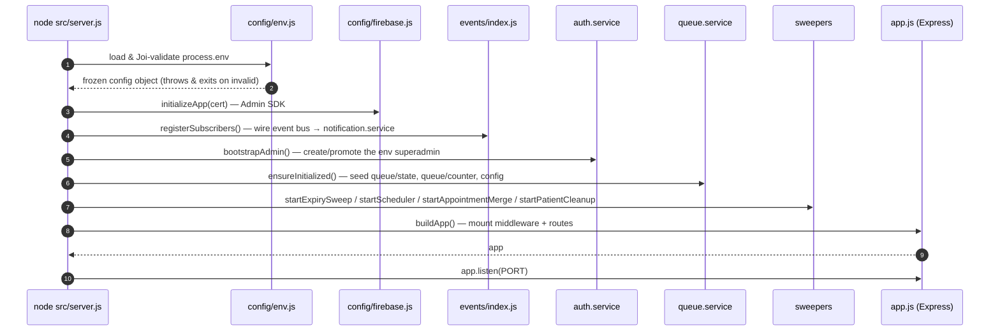

Fatal errors during `main()` exit the process (Render restarts it).
`unhandledRejection` / `uncaughtException` are reported via `reportError` and the
process is allowed to crash so the platform restarts it cleanly.

---

## 3. Layered architecture

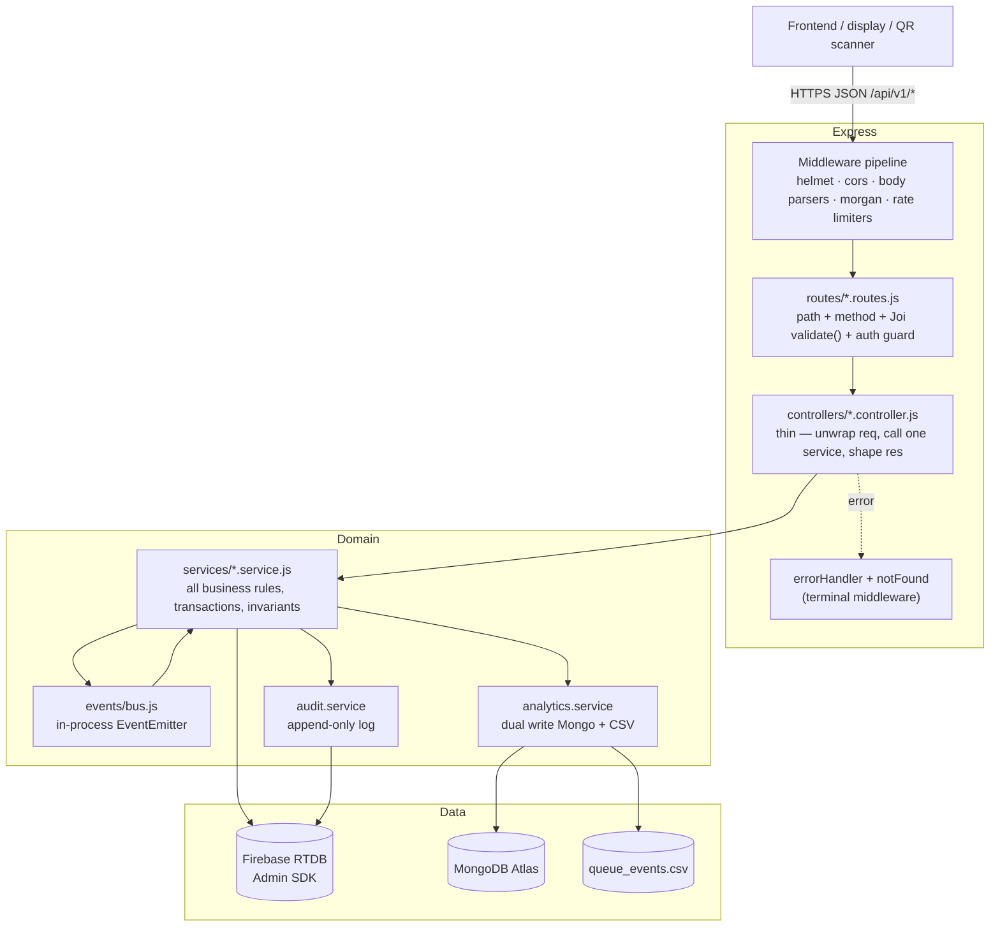

**Rule of thumb:** controllers never touch RTDB directly (a few legacy spots in
`index.js` and `staff.controller.setTokenNote` do); all invariants live in
services; services never touch `req`/`res`.

---

## 4. Request lifecycle

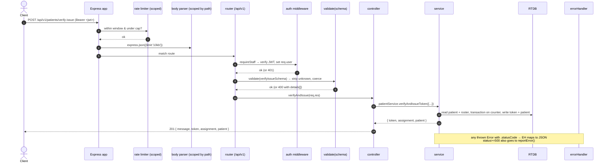

### Middleware order (`app.js`)

1. `helmet()` — security headers, `x-powered-by` disabled, `trust proxy = 1`
2. `cors({ origin: CORS_ORIGIN.split(',') })`
3. **Scoped** JSON parsers first: `/api/v1/conversations` → 512 kb,
   `/api/v1/uploads` → 4 mb; then the global `express.json({ limit: '10kb' })`
4. `morgan` (`dev` in non-prod, `combined` in prod)
5. Scoped rate limiters: `/api/v1/auth/login` (20 / 15 min),
   `/api/v1/tokens` (10 / min)
6. `GET /` health/version
7. `app.use('/api/v1', routes)`
8. `notFound` → 404 `{ error: "Route not found: METHOD path" }`
9. `errorHandler` → `{ error, stack? }` with `err.statusCode || 500`

---

## 5. Routing map

Mounted under `/api/v1` in `routes/index.js`. Guard column: **public** = no auth,
**staff** = `requireStaff` (admin-tier OR `staff` role), **admin** =
`requireAdmin` (admin-tier only), **role:X** = `requireRole('X')`.

| Prefix | File | Notable routes | Guard |
|---|---|---|---|
| `/auth` | `auth.routes` | `POST /login` | public (rate-limited) |
| `/tokens` | `token.routes` | `POST /` take, `GET /:id` status, `POST /:id/requeue` | public (rate-limited) |
| `/patients` | `patient.routes` | `POST /register` (public), `POST /reception/register`, `GET /pending`, `GET /registrations`, `GET /summary`, `GET /:id/status` (public), `POST /verify-issue`, `GET/PUT /:id`, `POST /:id/cancel` | mixed |
| `/roster` | `roster.routes` | `GET /public` (public), `GET /`, `POST /doctors` (admin), `DELETE /doctors/:username` (admin), `POST /availability`, `POST /reassign` (admin) | mixed |
| `/consultations` | `consultation.routes` | `GET /lab-tests`, `GET /`, `PUT /:id`, `POST /:id/lab-orders`, `POST /:id/complete` | staff |
| `/admin` | `admin.routes` | queue control, analytics, config, feedback, staff CRUD, token note/refer/skip, announcements, appointments, custom queues, admin accounts | admin / role:X |
| `/staff` | `staff.routes` | `POST /login`, `POST /login/pin` (public), `GET /queue`, `POST /queue/call-next`, `PUT /queue/tokens/:id/note`, `POST /queue/refer/:id`, profile, change-password | mixed |
| _(root)_ | `messaging.routes` | `/directory`, `/conversations*`, `/notifications*` | staff (per-route) |
| _(root)_ | `share.routes` | `/shares*` (staff), `GET /share/:id` (public capability link) | mixed |
| _(root)_ | `upload.routes` | `/uploads*` | staff |
| _(root)_ | `index.js` | `POST /feedback`, `POST /client-error`, `GET /config`, `GET /announcement`, `POST /appointments`, `GET /health` | public |

---

## 6. Authentication & authorization

### JWT payload

```jsonc
// admin-tier token (auth.service.login)
{ "sub": "<username>", "role": "superadmin|admin|manager", "displayName": "…", "iat": …, "exp": … }

// staff token (staff.service.loginStaff / loginByPin)
{ "sub": "<username>", "role": "staff", "service": "<queue key, e.g. opd>", "displayName": "…" }
```

`JWT_SECRET` signs; `JWT_EXPIRES_IN` (default `8h`; PIN login is fixed `12h`).
The `service` claim on staff tokens is the single source of truth for *which
counter a staff member operates* — it can't be spoofed by the client.

### Guard hierarchy (`config/roles.js`)

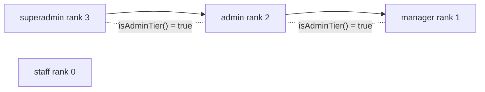

| Middleware | Passes when |
|---|---|
| `requireAdmin` | `isAdminTier(role)` — superadmin, admin, manager |
| `requireStaff` | `isAdminTier(role) OR role === 'staff'` |
| `requireRole('admin')` | admin-tier AND `atLeast(role,'admin')` |
| `requireRole('superadmin')` | role === superadmin |

`extractPayload()` returns 401 on a missing/`Bearer`-less header, expired token
(`Token expired.`), or bad signature (`Invalid token.`).

### Constant-time login

`auth.service.login` and `staff.service.loginStaff` always run `bcrypt.compare`
against a dummy hash when the username is unknown, so response time doesn't leak
account existence.

### Department resolution (`patient.controller.resolveDepartment`)

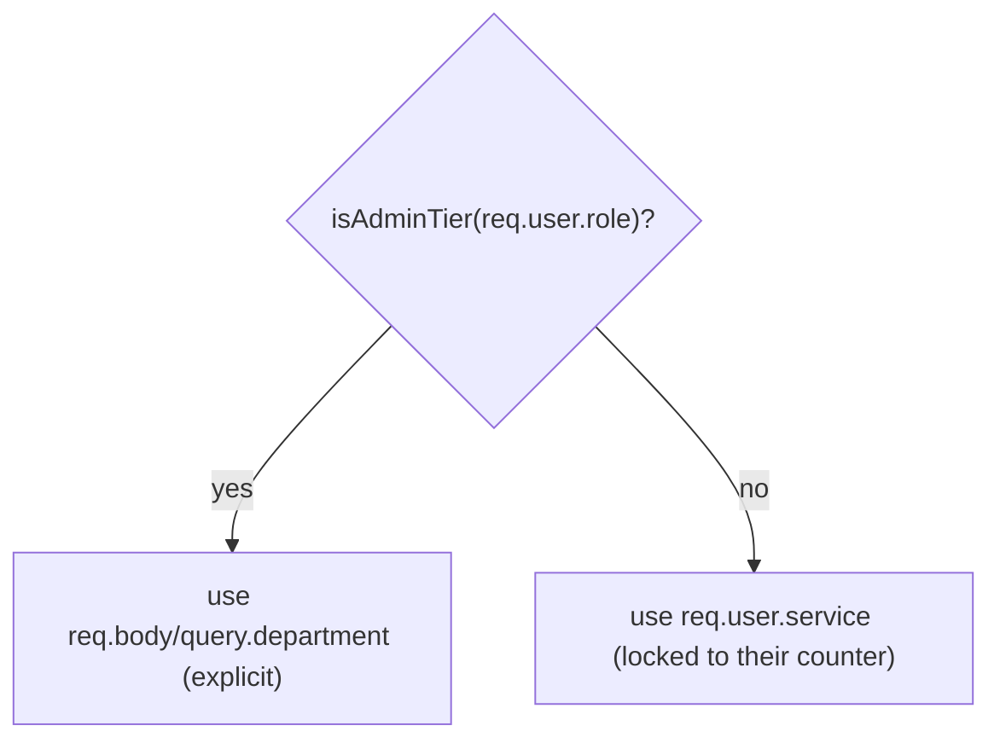

---

## 7. Data model (Firebase RTDB)

`config/firebase.js → refs` is the **only** place raw paths are written. Client
read/write access is governed by `firebase/database.rules.json`.

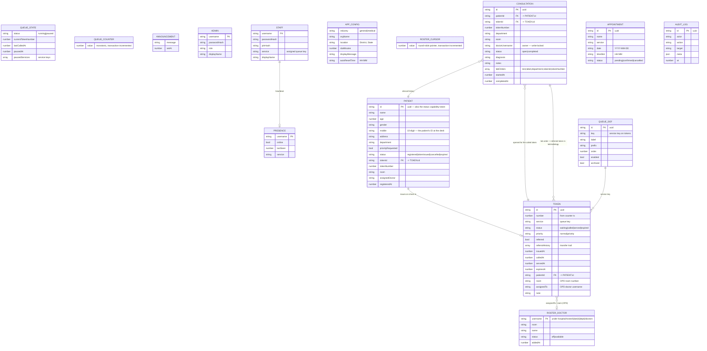

### RTDB tree (top level)

```
queue/
  state, counter, tokens/{id}, announcement
config/                         app config (industry, orgName, location, SLA, …)
queues/{id}                     admin-defined custom queue definitions
admins/{username}               admin-tier accounts
staff/{username}                counter operators
presence/{username}             live online/offline (client-writable, scoped)
appointments/{id}
auditLogs/{id}
feedback/{tokenId}
hospital/
  patients/{id}                 PII — backend-only
  roster/{YYYY-MM-DD}/{dept}/doctors/{username}, .../cursor
  consultations/{id}
conversations/…, notifications/…, uploads/…, shares/…   (backend-only content)
messageSignals/{id}, notificationSignals/{username}     (content-free realtime pings)
```

### Client access rules (`database.rules.json`)

| Path | `.read` | `.write` | Notes |
|---|---|---|---|
| `queue/state`, `queue/tokens`, `queue/announcement` | **true** | false | display + customer live sync |
| `queue/counter` | false | false | monotonic; server tx only |
| `presence/$username` | true | **true** (self only, shape-validated) | the only client write in the app |
| `messageSignals`, `notificationSignals` | true | false | content-free "refetch now" pings |
| `hospital/**`, `admins`, `conversations`, `notifications`, `uploads` | false | false | served exclusively via the JWT API |

---

## 8. Domain services

### 8.1 Queue engine — `queue.service.js`

State machine for a token:

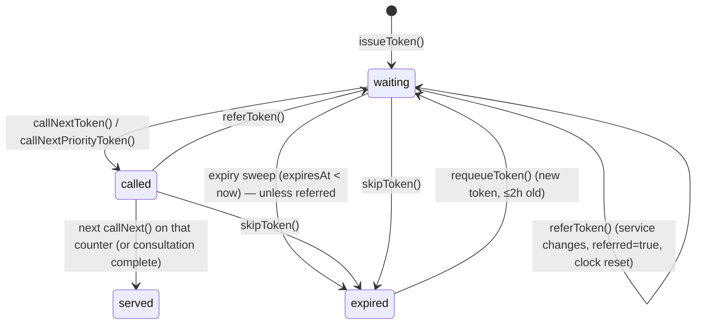

Key invariants:

- **Token number allocation** is a `refs.counter().transaction()` — safe under
  concurrent `issueToken` calls. Numbers are org-wide, not per-service.
- **Priority blocking:** `callNextToken` throws `409 PRIORITY_BLOCKING` if any
  priority-tier token is waiting anywhere and the next regular token isn't
  priority. `isPriorityTier(t) = t.priority === 'priority' || t.referred`.
- **Pause gates:** global pause blocks all non-priority issue + all `callNext`;
  per-service pause (`state.pausedServices[]`) blocks that one service.
- **`callNextToken(service, staff, {assignedTo})`** — when `assignedTo` is set
  (OPD doctor = their own username), the caller only clears *their own* `called`
  token and is served their own `assignedTo` tokens first, then unassigned ones.
- **Atomic call:** the "serve previous + call next + bump `state`" write is one
  `db.ref('queue').update(multiPathUpdate)`.
- **Referral** keeps the token number, appends to `referralHistory[]`, sets
  `referred=true`, resets `expiresAt` (a referred patient is physically present).

### 8.2 Patient registry — `patient.service.js`

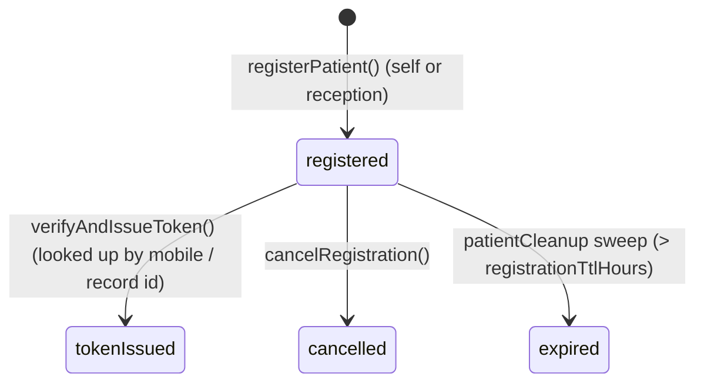

- **The 10-digit mobile number is the patient's ID.** No Aadhaar is collected.
  Validated as `^[6-9]\d{9}$`.
- **Duplicate guard:** one `registered` record per `(mobile, department)` → `409`.
  Same mobile in a different department is allowed.
- **`verifyAndIssueToken({ patientId?, mobile?, department })`** loads the record
  by `patientId` (staff picked it from the pending list) or finds the
  `registered` record by `(mobile, department)`, then:
  1. `dept === 'opd'` → `rosterService.assignRoom('opd')` (round-robin)
  2. `queueService.issueToken({ service, patientId, priority, room, assignedTo })`
  3. patient → `tokenIssued` with `room` + `assignedDoctor`
- **Priority:** `department === 'emergency'` OR `priorityRequested` → priority token.

### 8.3 Daily roster — `roster.service.js`

Keyed `hospital/roster/{YYYY-MM-DD IST}/{dept}`.

| Function | Guard | Behaviour |
|---|---|---|
| `getRoster(dept)` | staff | doctors sorted by room + live `waiting` count per doctor + `unassignedWaiting` |
| `addDoctor(dept,{username,room})` | admin | staff account must exist and its `service` must equal `dept` |
| `setAvailability(dept,username,status)` | staff (self) | `409` if the caller isn't on today's roster |
| `assignRoom(dept)` | internal | `rosterCursor` transaction → `available[(cursor-1) % n]`; `null` when nobody available |
| `reassign(dept, from)` | admin | move `from`'s (or `'unassigned'`) still-`waiting` tokens round-robin to available doctors; updates both token and patient records |
| `removeDoctor(dept,username)` | admin | `reassign` first (no stranded patients), then delete |

### 8.4 Consultations — `consultation.service.js`

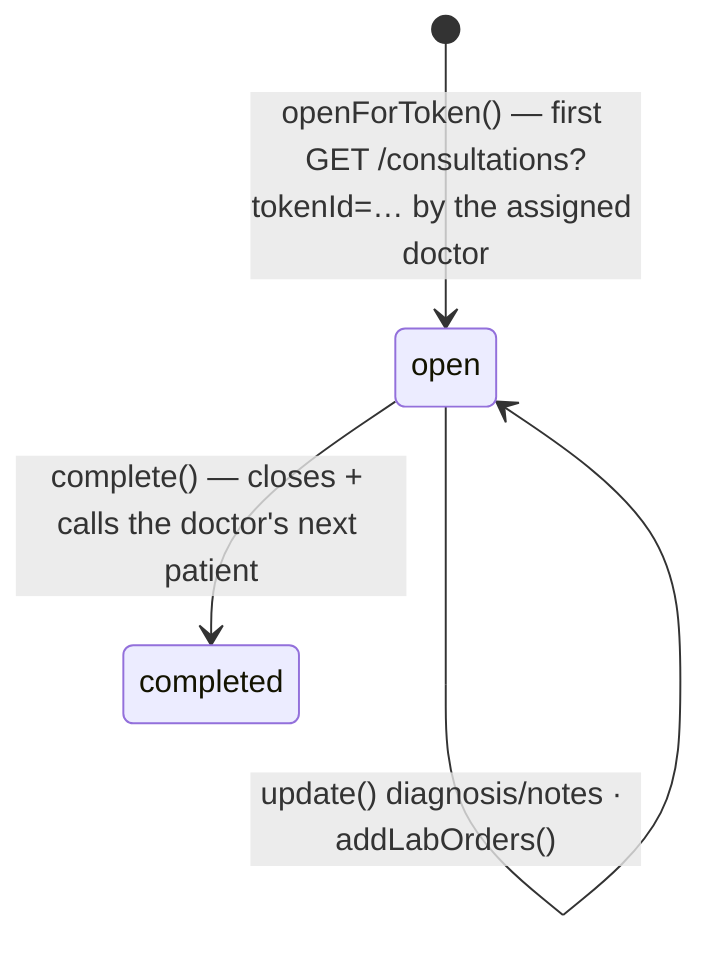

- **Ownership lock:** every mutation checks `c.doctorUsername === req.user.sub`
  → `403` otherwise. `openForToken` also checks `token.assignedTo`.
- **Lab orders** (`LAB_TESTS` map): CT / MRI / X-Ray / Ultrasound → `radiology`,
  ECG → `cardiology`, blood / urine → `lab`. Each ordered test calls
  `queueService.issueToken({ service: target, referred: true, patientId, note })`
  → the patient appears in that queue as a referred (priority-tier) token.
- **`complete()`** sets `completed`, then
  `queueService.callNextToken(dept, doctor, { assignedTo: doctor })` — the
  "Consultation done → call next" action in one call.
- **History:** `historyForPatient(patientId)` returns all prior consultations for
  the same `patientId`, newest first — a permanent per-patient clinical record.

### 8.5 Analytics — `analytics.service.js`

- Every lifecycle event (`token_issued`, `token_called`, `token_served`,
  `token_skipped`, `token_referred`, `patient_registered`, `queue_*`) →
  `logEvent()` → **append CSV row** (schema-guarded; a header mismatch archives
  the old file) **and** `insertOne` into Mongo (if `ANALYTICS_SINK=mongo`).
- All analytics writes are `.catch()`-swallowed — analytics never breaks a request.
- `getTrafficStats()` / `getStaffMetrics()` feed the admin analytics screen and
  the live `avgServiceSeconds` in `GET /config`.

### 8.6 Audit — `audit.service.js`

`record({ actor, action, target, meta })` → append to `auditLogs/{uuid}`.
Fire-and-forget, never throws. `list({ limit })` powers `GET /admin/audit`.

---

## 9. Event bus

`events/bus.js` is a thin `EventEmitter` wrapper. Emitting is deferred to
`setImmediate` (zero added request latency); handler errors are isolated.

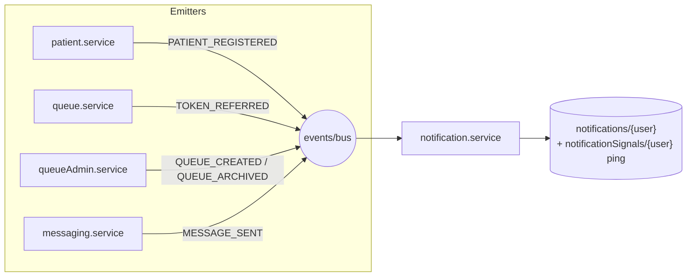

`events/index.registerSubscribers()` wires the five subscriptions at boot.
`notification.service` turns each event into per-user notification rows and bumps
the content-free `notificationSignals/$username` node the frontend listens on.

---

## 10. Background jobs (`server.js` starts all at boot)

| Service | Interval | Job |
|---|---|---|
| `expiry.service` | 5 min | `waiting` tokens with `expiresAt < now` → `expired` (skips `referred`) |
| `patientCleanup.service` | 10 min | `registered` patients older than `PATIENT_REGISTRATION_TTL_HOURS` → `expired` |
| `scheduler.service` | 1 min | at `config.autoResetTime` (Asia/Karachi) once/day → `queueService.resetQueue()` |
| `appointmentMerge.service` | 1 min | `confirmed` appointments within ±5 min of their slot → issue a priority token |

All are `try/catch`-wrapped and log-only on failure. `SIGTERM`/`SIGINT` stops
every timer and closes the Mongo client before `process.exit(0)`.

---

## 11. Error handling & status codes

Services throw plain `Error` objects with a `.statusCode` property
(`Object.assign(new Error(msg), { statusCode: 409 })`). `errorHandler`:

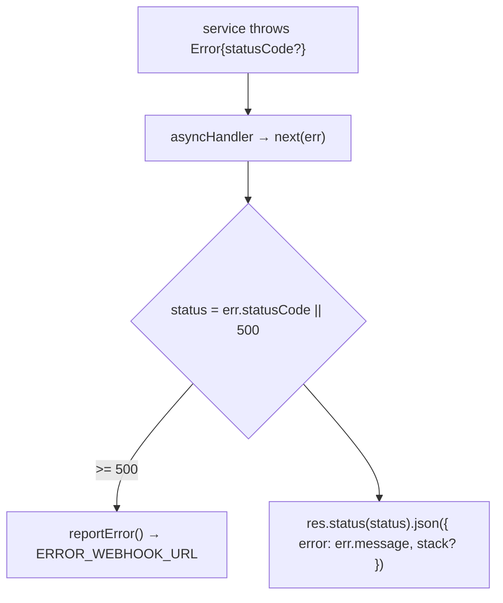

| Code | Meaning in this system |
|---|---|
| 400 | Joi validation failed (`{ error, details: [{path,message}] }`), or a missing required field |
| 401 | bad/absent/expired JWT, wrong password/PIN |
| 403 | authenticated but wrong tier/role, or not the consultation owner / wrong room |
| 404 | token / patient / consultation / account / route not found |
| 409 | duplicate registration, double token issue, `PRIORITY_BLOCKING`, roster conflict (wrong service, not rostered), illegal state transition |
| 423 | queue or service is paused |
| 429 | rate limiter tripped |
| 500 | unexpected — reported to the webhook |

---

## 12. Security summary

- **No Firebase Auth.** All privileged data is written by the Admin SDK behind
  the JWT API; clients can only *read* the public queue nodes and *write* their
  own `presence` node.
- Passwords + PINs: bcrypt (10 rounds). Patient PII: name, mobile, address — no
  government IDs collected.
- Rate limits: login (20 / 15 min), take-token (10 / min), patient register
  (5 / min), messaging assistant-style caps.
- `helmet`, CORS allow-list from `CORS_ORIGIN`, `x-powered-by` off, `trust proxy`.
- The patient-status endpoint (`GET /patients/:id/status`) is public but the
  `:id` is an unguessable UUID acting as a capability token; it returns first
  name + status + token/room only — no demographics.
- Secrets (`JWT_SECRET`, `FIREBASE_PRIVATE_KEY`, admin creds) are Render
  environment variables, never committed.

---

## 13. Configuration (`config/env.js`, Joi-validated)

| Var | Purpose |
|---|---|
| `JWT_SECRET`, `JWT_EXPIRES_IN` | token signing / lifetime |
| `ADMIN_USERNAME`, `ADMIN_PASSWORD` | bootstrap superadmin |
| `ADMIN_RESET_ON_BOOT` | break-glass password reset flag |
| `FIREBASE_PROJECT_ID / CLIENT_EMAIL / PRIVATE_KEY / DATABASE_URL` | Admin SDK |
| `CORS_ORIGIN`, `FRONTEND_URL` | allow-list + email tracking links |
| `AVG_SERVICE_TIME_SECONDS`, `TOKEN_EXPIRY_SECONDS` | wait estimates, expiry clock |
| `PATIENT_REGISTRATION_TTL_HOURS` | stale-registration sweep |
| `ANALYTICS_SINK` (`csv`\|`mongo`), `ANALYTICS_CSV_PATH`, `MONGO_URI` | analytics store |
| `SMTP_*` | optional token emails |
| `ERROR_WEBHOOK_URL` | Slack/Discord 5xx + client-error feed |

Invalid config → `console.error` the Joi details and `process.exit(1)` before the
server binds.
