# End-to-End Flows & API Call Sequences

Open this file to understand **how a request travels through the system** — from a
click in the browser, through the REST API, into the services and Firebase, and
back. Every diagram is a real code path with the actual function and endpoint
names.

> Companion docs: [LLD-Backend.md](LLD-Backend.md) · [LLD-Frontend.md](LLD-Frontend.md) · [API.md](API.md)

---

## How to read these diagrams

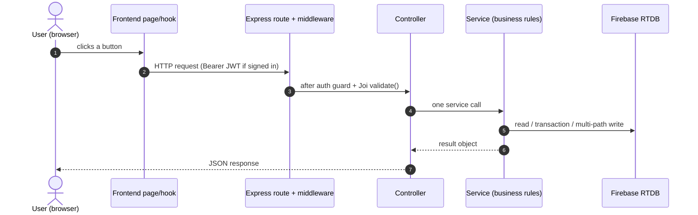

- **`alt` / `opt`** blocks = branching. The label is the condition.
- A dashed return arrow (`-->>`) is a response; a solid arrow (`->>`) is a call.
- "RTDB" is Firebase Realtime Database, written server-side via the Admin SDK.
- Live (push) updates to the browser come from Firebase `onValue`, drawn as a
  separate arrow from RTDB to the frontend.

---

## Index

1. [Authentication](#1-authentication)
2. [Customer — take & track a token](#2-customer--take--track-a-token)
3. [Hospital OPD — the full patient journey](#3-hospital-opd--the-full-patient-journey)
   - 3.1 [Patient registration](#31-patient-registration)
   - 3.2 [Daily roster setup](#32-daily-roster-setup)
   - 3.3 [Check-in & room assignment](#33-check-in--room-assignment)
   - 3.4 [Doctor calls the next patient](#34-doctor-calls-the-next-patient)
   - 3.5 [Consultation, lab orders, and "done"](#35-consultation-lab-orders-and-done)
   - 3.6 [Doctor stand-down & patient reassignment](#36-doctor-stand-down--patient-reassignment)
4. [Display board data flow](#4-display-board-data-flow)
5. [Queue control (admin / staff)](#5-queue-control-admin--staff)
6. [Background jobs](#6-background-jobs)
7. [Error mapping reference](#7-error-mapping-reference)

---

## 1. Authentication

### 1.1 Admin login

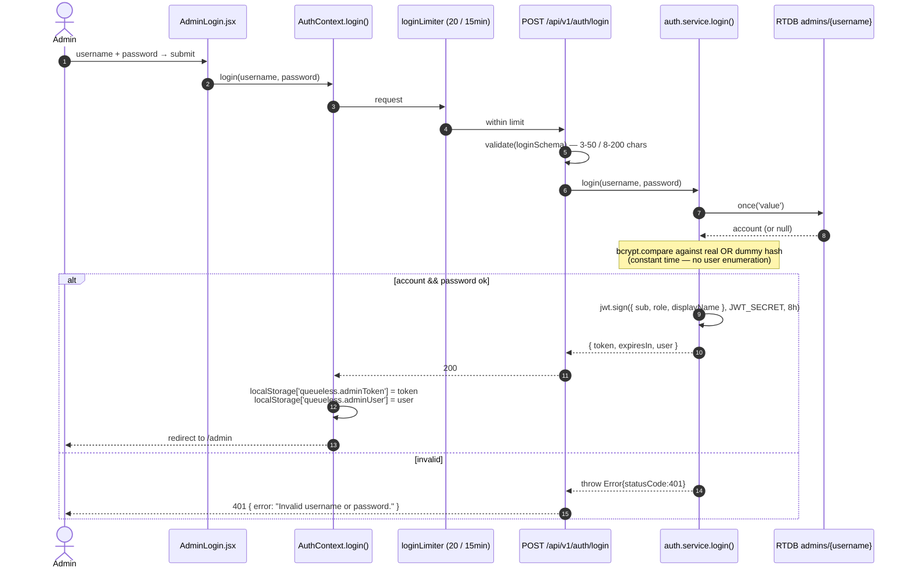

### 1.2 Staff login (password or kiosk PIN)

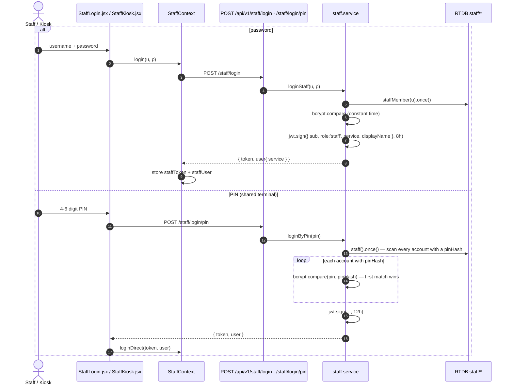

The **`service` claim** on the staff JWT is what locks a staff member to their
counter — `patient.controller.resolveDepartment()` and
`staff.controller.callNext()` both read `req.user.service`, never a body param.

### 1.3 Session expiry watchdog (client-side)

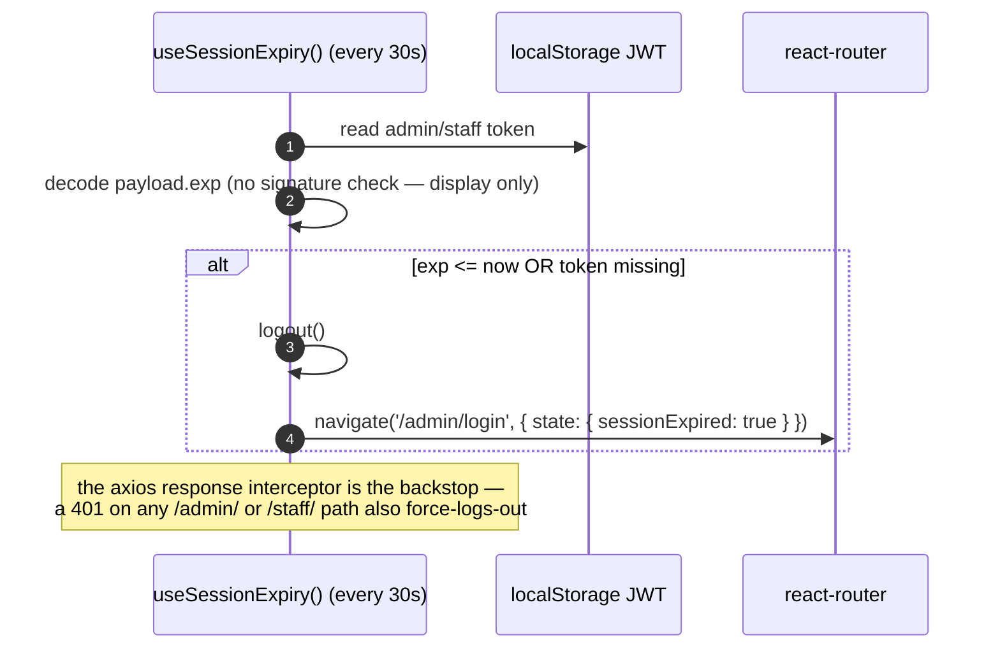

---

## 2. Customer — take & track a token

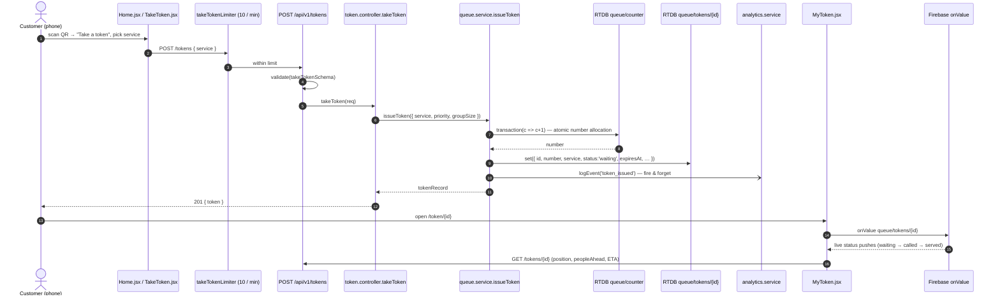

`GET /tokens/:id` computes `positionInQueue`, `peopleAhead`, and
`estimatedWaitSeconds` (= people ahead × live average wait) — the average comes
from `analytics.getTrafficStats()`, falling back to `AVG_SERVICE_TIME_SECONDS`.

---

## 3. Hospital OPD — the full patient journey

**One patient, start to finish.** OPD runs multiple consulting rooms; each doctor
is a sub-queue.

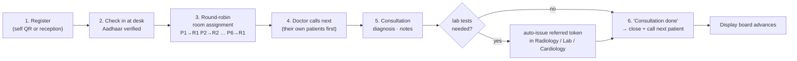

### 3.1 Patient registration

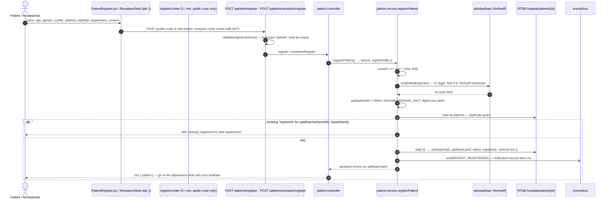

The raw Aadhaar number is **never** stored or returned. `hospital/**` is
`.read: false` in the DB rules — the patient record is only ever served through
the JWT API.

### 3.2 Daily roster setup

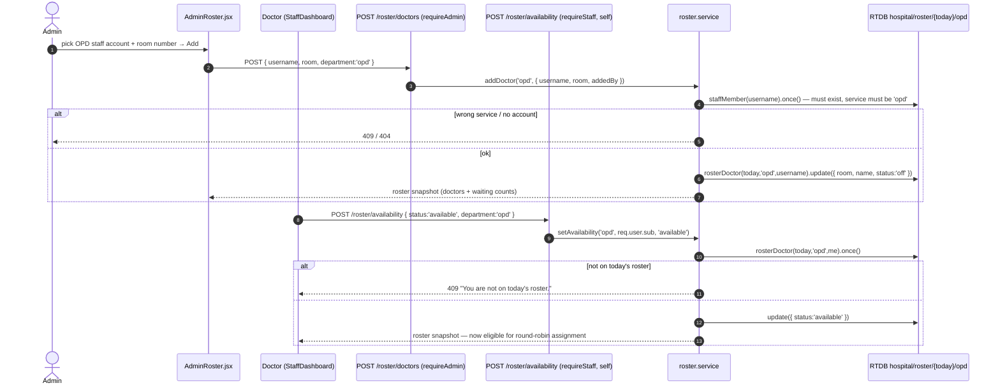

### 3.3 Check-in & room assignment

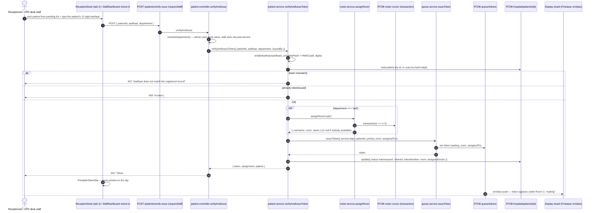

**Round-robin math** (`roster.service.assignRoom`): with `available` doctors
sorted by room, the cursor transaction returns a monotonically increasing
integer; the pick is `available[(cursor - 1) % available.length]`. So P1→room 1,
P2→room 2, P3→room 1 (2 doctors), matching the spec.

### 3.4 Doctor calls the next patient

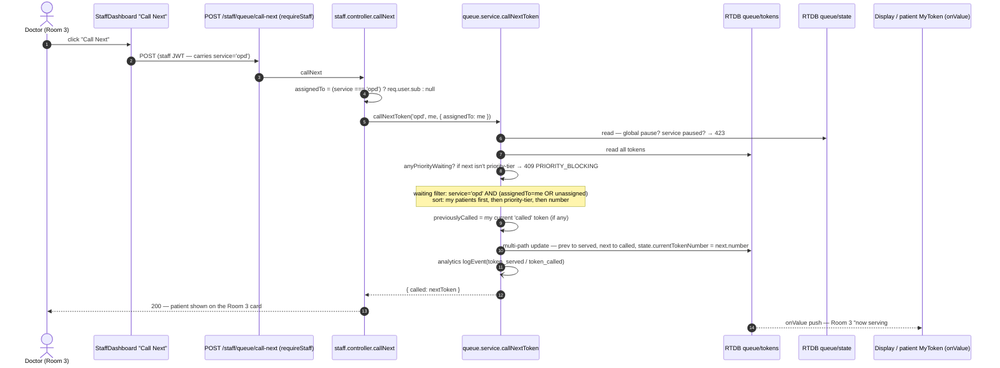

### 3.5 Consultation, lab orders, and "done"

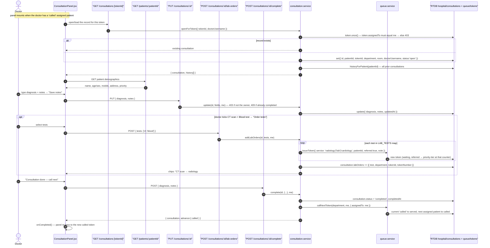

**Lab order routing map** (`consultation.service.LAB_TESTS`):

| Test id | Label | Routed to queue |
|---|---|---|
| `ct`, `mri`, `xray`, `ultrasound` | CT scan / MRI / X-Ray / Ultrasound | `radiology` |
| `ecg` | ECG | `cardiology` |
| `blood`, `urine` | Blood test / Urine test | `lab` |

The ordered token is `referred: true`, so `isPriorityTier()` is true and the lab
serves it ahead of fresh walk-ins. The same `patientId` links it back to the
patient record and the originating consultation.

### 3.6 Doctor stand-down & patient reassignment

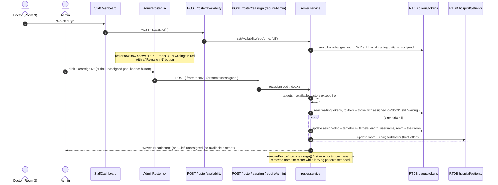

Already-`called` patients are left alone (the doctor is mid-consultation); only
still-`waiting` tokens move.

---

## 4. Display board data flow

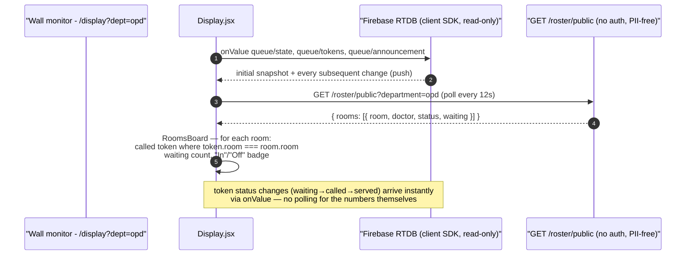

| URL | Renders |
|---|---|
| `/display` | grid — one card per service (now-serving number + first 6 waiting) |
| `/display?dept=opd` (roster exists) | `RoomsBoard` — one card per consulting room |
| `/display?dept=cardiology` (no roster) | `SingleDepartmentBoard` — big NOW SERVING + UP NEXT list |

`GET /roster/public` returns **room + doctor name + status + waiting count only**
— no usernames, no PII — so it's safe to serve unauthenticated to a screen.

---

## 5. Queue control (admin / staff)

### 5.1 Call next / priority blocking

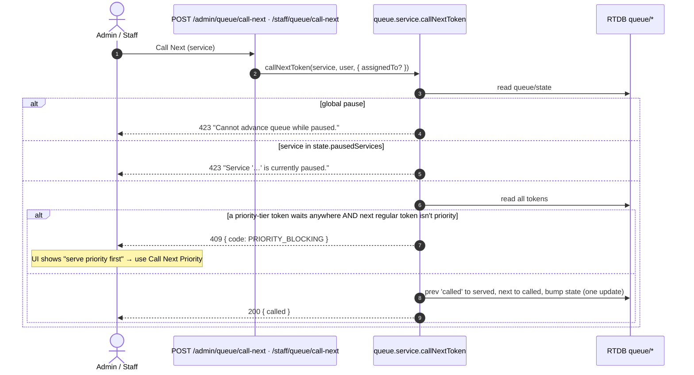

### 5.2 Refer a token to another counter

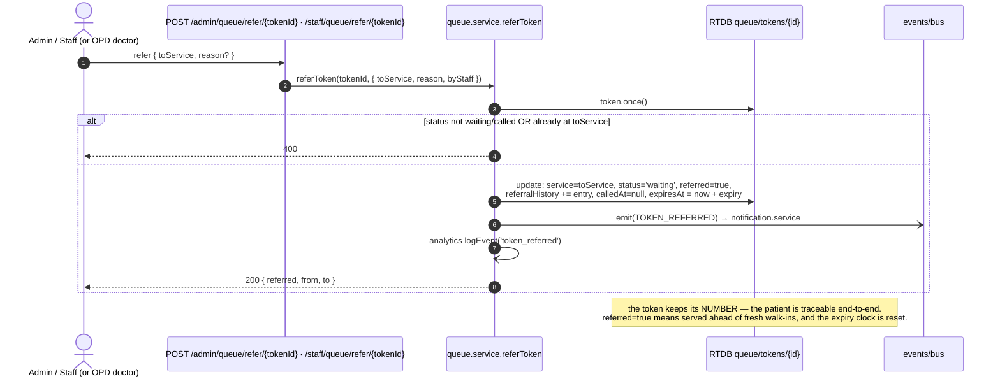

### 5.3 Pause / resume / reset

| Action | Endpoint | Effect |
|---|---|---|
| Pause queue | `POST /admin/queue/pause` | `state.status='paused'` — blocks all non-priority issue + all call-next |
| Resume | `POST /admin/queue/resume` | `state.status='running'` |
| Pause one service | `POST /admin/queue/pause-service {service}` | adds to `state.pausedServices[]` |
| Reset | `POST /admin/queue/reset` | **deletes all tokens**, `counter=0`, state back to defaults |
| Skip / no-show | `POST /admin/queue/skip/{tokenId}` | `waiting`/`called` token → `expired` |

---

## 6. Background jobs

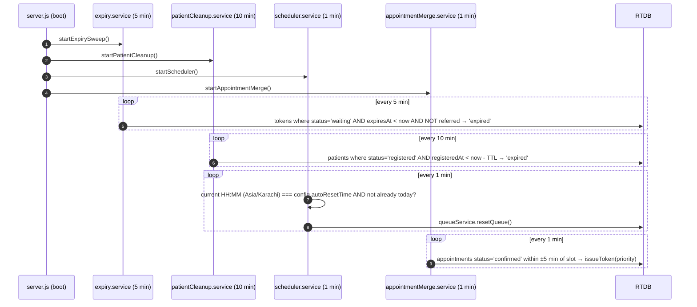

All sweepers are `try/catch` + log-only; a failure never crashes the process.
`SIGTERM`/`SIGINT` stops every timer and closes Mongo before exit.

---

## 7. Error mapping reference

The frontend surfaces `err.response.data.error` verbatim in an inline banner.
Backend services produce these by throwing `Object.assign(new Error(msg), { statusCode })`.

| Status | `code` | Where it comes from | User sees |
|---|---|---|---|
| 400 | — | `validate(schema)` failed | "Validation failed." + `details[]` |
| 400 | — | missing `department` / `from` / `tests` | field-specific message |
| 401 | — | bad/expired JWT, wrong password/PIN | "Invalid token." / "Invalid username or password." — force logout on protected paths |
| 403 | — | wrong tier/role | "Forbidden - admin access required." |
| 403 | — | `consultation.doctorUsername !== me` / `token.assignedTo !== me` | "Not your consultation." / "This patient is assigned to another room." |
| 404 | — | token / patient / consultation / account / route missing | "… not found." |
| 409 | — | duplicate registration | "already registered for that department" |
| 409 | — | second `verify-issue` for same patient | "A token (#N) has already been issued" |
| 409 | `PRIORITY_BLOCKING` | `callNextToken` with priority waiting | "Please serve all priority tokens first" |
| 409 | — | roster: wrong service / not rostered | "… is assigned to 'x', not 'opd'." / "You are not on today's roster." |
| 422 | — | Aadhaar hash mismatch at check-in | "Aadhaar does not match the registered record" |
| 423 | — | queue or service paused | "Queue is currently paused." |
| 429 | — | rate limiter | "Too many … Please slow down." |
| 500 | — | unexpected | "Internal server error." — also sent to `ERROR_WEBHOOK_URL` |
