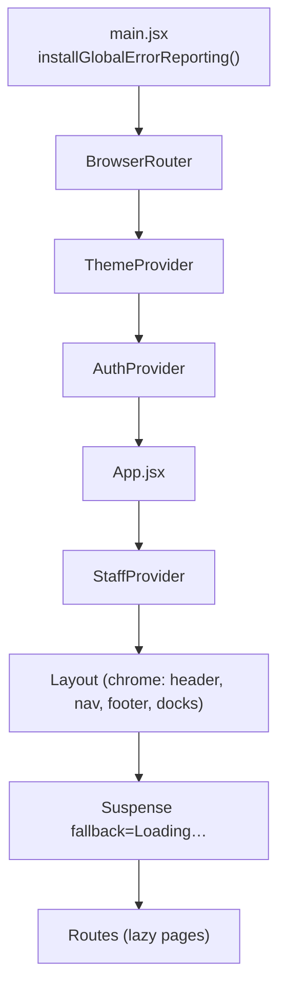
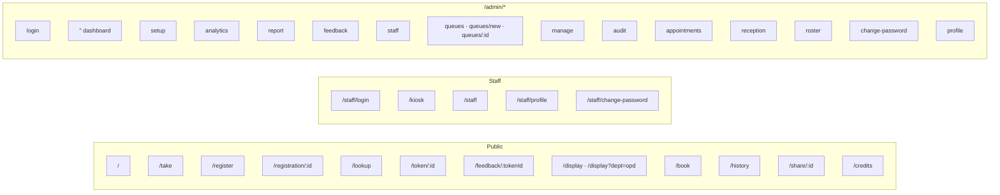
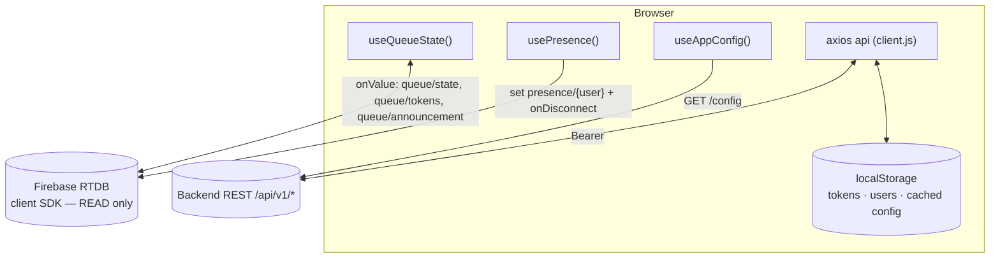
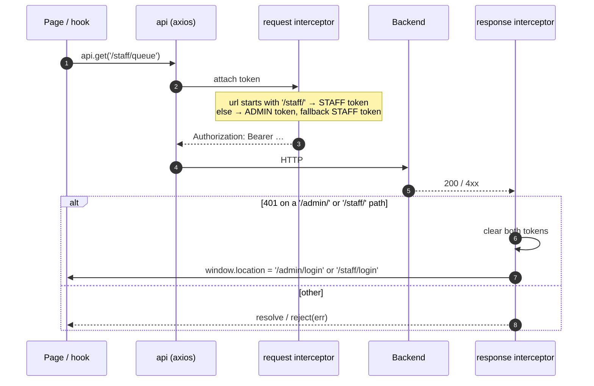
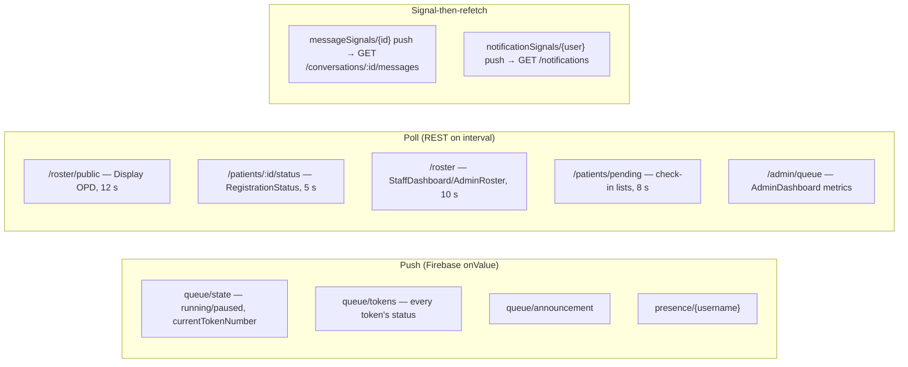
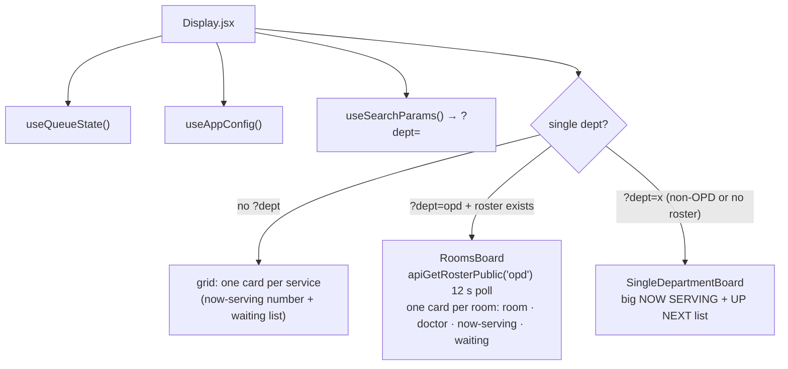
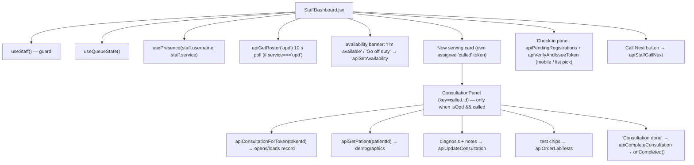
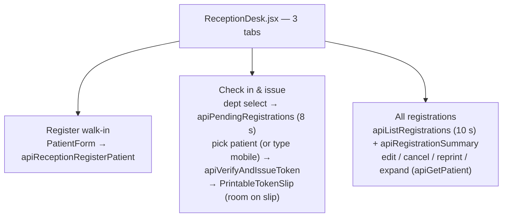
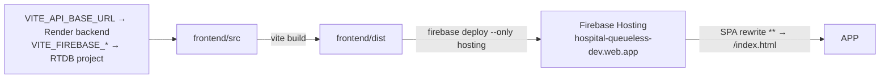

# Low-Level Design — Frontend

QueueLess web client. React 19 + Vite, React Router 7, Tailwind, Firebase client
SDK for **read-only live queue sync**, Axios for the JWT REST API. No Redux — state
is React Context + custom hooks + a tiny in-memory registry.

> Companion docs: [LLD-Backend.md](LLD-Backend.md) · [LLD-Flows.md](LLD-Flows.md)
> (end-to-end sequence diagrams) · [API.md](API.md).

---

## 1. Technology

| Concern | Choice |
|---|---|
| Framework | React 19, function components + hooks only |
| Build | Vite 8 (`npm run build` is the CI gate) |
| Routing | `react-router-dom` 7, all pages `lazy()` code-split |
| Styling | Tailwind, custom design tokens, light/dark via `ThemeContext` |
| REST client | Axios instance with request/response interceptors |
| Live data | `firebase/database` `onValue` subscriptions (queue state, presence, signals) |
| QR | `qrcode` (generate slips), camera scanning is the device's native app |
| Hosting | Firebase Hosting (`frontend/dist`), SPA rewrite `** → /index.html` |

The frontend holds **no secrets**. `VITE_FIREBASE_*` are public config;
`VITE_API_BASE_URL` points at the Render backend.

---

## 2. Bootstrap & provider tree

- **`ThemeProvider`** — `dark` boolean, persisted to `localStorage`, respects
  `prefers-color-scheme`; toggling sets `data-theme` on `<html>`.
- **`AuthProvider`** — admin session (`user`, `login`, `logout`, `updateUser`).
  Token in `localStorage['queueless.adminToken']`, user in `…adminUser`.
- **`StaffProvider`** — staff session (`staff`, `login`, `loginDirect`, `logout`).
  Token in `…staffToken`, user in `…staffUser`. `loginDirect` is used by the
  kiosk PIN flow.
- **`Layout`** — the only always-mounted component. Renders header/nav by
  session, the sign-out flow, and the two floating docks (`MessagingDeck`,
  `NotificationBell` self-hide unless signed in). It calls `useSessionExpiry()`.

---

## 3. Routing map

All routes are public at the router level — **page components self-guard** with
`<Navigate to="/admin/login">` / `<Navigate to="/staff/login">` when the relevant
context is empty. `Layout` returns bare children for `/display` (no chrome).

| Page | Route | Data sources |
|---|---|---|
| `Home` | `/` | `useQueueState` (live), `useAppConfig`, generates join QR |
| `PatientRegister` | `/register` | `POST /patients/register` |
| `RegistrationStatus` | `/registration/:id` | polls `GET /patients/:id/status` every 5 s until `tokenIssued` |
| `Display` | `/display[?dept=]` | `useQueueState` (live) + `GET /roster/public` (OPD, 12 s poll) |
| `ReceptionDesk` | `/admin/reception` | patients + roster + verify-issue APIs |
| `StaffDashboard` | `/staff` | `useQueueState`, roster + consultation APIs, `usePresence` |
| `AdminRoster` | `/admin/roster` | `GET /admin/staff`, `/roster*` |
| `AdminDashboard` | `/admin` | `useQueueState`, `apiActiveQueue`, queue-control APIs |

---

## 4. Data layer

Two independent channels — **read live over Firebase, write over the JWT REST API.**

### 4.1 Axios instance — `services/api/client.js`

- Base URL: `VITE_API_BASE_URL` (fallback `http://localhost:4000/api/v1`),
  10 s timeout.
- **Token routing is by URL prefix** — `/staff/*` always uses the staff JWT
  (it carries the `service` claim); everything else prefers the admin JWT.
- A 401 from a **public** endpoint (e.g. cold-start `/config`) does **not**
  wipe the session — only protected paths force logout.

### 4.2 API client modules — `services/api/*`

`api.js` is a barrel that re-exports every module. Each file wraps `api.*` calls
returning `res.data`.

| Module | Covers |
|---|---|
| `public.js` | `apiTakeToken`, `apiTokenStatus` |
| `patients.js` | register, reception-register, pending, registrations, summary, status, get, update, cancel, verify-issue |
| `roster.js` | `apiGetRoster`, `apiGetRosterPublic`, `apiAddRosterDoctor`, `apiRemoveRosterDoctor`, `apiSetAvailability`, `apiReassignRoster` |
| `consultations.js` | `apiConsultationForToken`, `apiPatientConsultations`, `apiLabTests`, `apiUpdateConsultation`, `apiOrderLabTests`, `apiCompleteConsultation` |
| `auth.js` | `apiLogin` |
| `staff.js` | staff login/PIN, `apiStaffQueue`, `apiStaffCallNext`, profile; admin-side `apiListStaff`, `apiCreateStaff`, `apiDeleteStaff`, `apiAssignStaffQueue` |
| `queue.js` | `apiActiveQueue`, `apiCallNext`, `apiCallNextPriority`, `apiSkipToken`, `apiPause/Resume/Reset`, `apiPauseService/ResumeService`, `apiReferToken`, `apiStaffReferToken`, token notes |
| `queues.js` | custom queue CRUD |
| `analytics.js` | `apiAnalytics`, `apiStaffMetrics`, `apiFeedback` |
| `admin.js` | config, announcements, appointments, admin accounts, audit |
| `messaging.js` / `notifications.js` | chat + notification center |
| `share.js` / `files.js` | capability links + RTDB-backed files |

### 4.3 Live hooks

| Hook | Subscribes / calls | Returns |
|---|---|---|
| `useQueueState()` | `onValue` on `queue/state`, `queue/tokens`, `queue/announcement` | `{ state, tokens, announcement, loading, error }` — re-renders on every push |
| `useTokenLive(id)` | `onValue` on `queue/tokens/{id}` | that token, live |
| `usePresence(username, service)` | writes `presence/{username}` on `.info/connected`, registers `onDisconnect` | — (side effect only) |
| `useAppConfig()` | `GET /config` on mount + listens for `window 'queueless:config'` events | config object (falls back to `{industry:'general', orgName:'QueueLess'}`) |
| `useQueues()` | derives from `useAppConfig` + `queueRegistry` | `{ services, labelOf, prefixOf, hasCustom, industry }` |
| `useSessionExpiry()` | decodes the stored JWT `exp` every 30 s | signs out + redirects with `state.sessionExpired` when expired |

**`queueRegistry.js`** is a module-level array of the org's custom queues,
populated by `useAppConfig`. `getServiceLabel()` / `getServices()` read it so any
component that resolves a token's `service` to a label shows custom-queue names
without per-page wiring.

---

## 5. Real-time model — what is push vs poll

Rule: **queue token state is real-time** (customers and the display board must
never look stale). Roster/consultation/patient-registry data is PII or
low-frequency, so it's polled or fetched on demand over the authenticated API.

---

## 6. Key screen component trees

### 6.1 Display board — `/display`

### 6.2 Staff dashboard — `/staff` (OPD doctor)

### 6.3 Reception desk — `/admin/reception`

---

## 7. Error handling

- **`ErrorBoundary`** wraps `<main>` and `/display`, keyed by `location.pathname`
  so navigation resets it. On catch it renders a fallback and posts to
  `POST /client-error`.
- **`installGlobalErrorReporting()`** (in `main.jsx`) adds `window`
  `error` + `unhandledrejection` handlers → deduped `POST /client-error` beacon.
- Page-level: every mutating call is wrapped `try/catch`, surfacing
  `e.response?.data?.error` in an inline banner.

---

## 8. Build & deploy

- `frontend/.env.production` holds the production `VITE_*` values (git-ignored;
  CI injects from `FIREBASE_HOSTING_ENV`).
- Vendor chunks are split (`vendor-react`, `vendor-firebase`); each page is its
  own lazy chunk.
- `/assets/**` is served `immutable` for a year; `index.html` is not cached, so a
  redeploy is picked up on the next full load.
